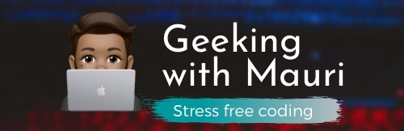

# Hi there. I'm Mauricio Chirino, but feel free to call me _Mauri_ 😄

## What do I do?

💻 I’m a software engineer, currently working full-time as an iOS developer (and have been doing so non-stop from 2016). On my spare time I like blogging, riding bike, reading ([A LOT](https://www.goodreads.com/user/show/95758480-mauricio-chirino)) and cooking 👨🏽‍🍳

In my spare time I maintain a couple of apps of mine. I also like building POCs and libraries for iOS and Swift development. Check them out:

### 📲 Apps

- [MatchWords](https://apps.apple.com/uy/app/matchwords-build-words/id1612434602)
- [MyStickers](https://apps.apple.com/uy/app/mystickers/id884352968)

### 🧪 POCs

- [CriptoWatcher](https://github.com/mchirino89/CriptoWatcher)
- [Rick and Morty wiki](https://github.com/mchirino89/RickAndMorty)
- [RestoApp](https://github.com/mchirino89/RestoYa)

### 🛠 Tools

- [MauriUtils](https://github.com/geekingwithmauri/MauriUtils): A set of canned helpers for Swift's rapid development and testing
- [MauriNet](https://github.com/geekingwithmauri/MauriNet): Wrapper for Swift's network handling
- [MauriKit](https://github.com/geekingwithmauri/MauriKit): Helpers and wrappers for code only UI iOS development in Swift

### 📝 Writing

I post regularly on [GeekingwithMauri.com](https://geekingwithmauri.com) and sometimes on [Medium](https://mchirino89.medium.com).

<!-- BLOG:START -->
- [Guarantee localization with SwitfUI](https://geekingwithmauri.com/swift/localizationWithSwiftUI.html)
- [Unit tests are not silver bullets](https://geekingwithmauri.com/work/testing.html)
- [What refactoring is not](https://geekingwithmauri.com/work/refactoring.html)
- [📖 Books I’ve read: Driving Technical Change &lpar;by Terrence Ryan&rpar;](https://geekingwithmauri.com/books/drivingTechChange.html)
- [Skills for succeeding on software development](https://geekingwithmauri.com/work/succeedingAtDevelopment.html)
<!-- BLOG:END -->
<!-- MEDIUM:START -->
- [Screenshots para tus tests](https://medium.com/peya-tech/screenshots-para-tus-tests-85598e4c5c4e?source=rss-8d0bd43333be------2)
- [Books I’ve read: The Pragmatic Programmer &lpar;by David Thomas &amp; Andrew Hunt&rpar;](https://mchirino89.medium.com/books-ive-read-the-pragmatic-programmer-by-david-thomas-andrew-hunt-ec493738b6fa?source=rss-8d0bd43333be------2)
- [Acing&lpar;ish&rpar; your iOS interview](https://mchirino89.medium.com/acing-ish-your-ios-interview-3b915e3b23d7?source=rss-8d0bd43333be------2)
- [5 key points in enjoying writing code for a living](https://mchirino89.medium.com/5-key-points-in-enjoying-writing-code-for-a-living-58797faaa368?source=rss-8d0bd43333be------2)
- [On testing 3rd party frameworks without losing your hair](https://mchirino89.medium.com/on-testing-3rd-party-frameworks-without-losing-your-hair-367ef8bfb56b?source=rss-8d0bd43333be------2)
<!-- MEDIUM:END -->

I also like to contribute back to the awesome [Stackoverflow's community](https://stackoverflow.com/users/2376336/mauricio-chirino?tab=profile) whenever possible 

<!-- STACKOVERFLOW:START -->
- [Answer by Mauricio Chirino for Detect UIScrollview bottom reached](https://stackoverflow.com/questions/20583882/detect-uiscrollview-bottom-reached/67549419#67549419)
- [Answer by Mauricio Chirino for Write unit test in swift package manager for API call](https://stackoverflow.com/questions/62129318/write-unit-test-in-swift-package-manager-for-api-call/65161977#65161977)
- [Answer by Mauricio Chirino for UIProgressView is not updating, but the title is](https://stackoverflow.com/questions/55007207/uiprogressview-is-not-updating-but-the-title-is/55007846#55007846)
- [Answer by Mauricio Chirino for Why does my app not display the alert to ask to access user&#39;s location?](https://stackoverflow.com/questions/55004779/why-does-my-app-not-display-the-alert-to-ask-to-access-users-location/55007753#55007753)
- [Answer by Mauricio Chirino for Swift: Cannot invoke &#39;filter&#39; with an argument list of type &#39;&lpar;&lpar;AnyObject&rpar; throws -&gt; Bool&rpar;&#39;](https://stackoverflow.com/questions/40902274/swift-cannot-invoke-filter-with-an-argument-list-of-type-anyobject-throws/54097170#54097170)
<!-- STACKOVERFLOW:END -->

### Github

After family responsibilities and work, I like keeping myself busy coding 🤓

    

&nbsp;
    

    

## 📫 How to reach me: 
 
- 

- 

- 

Need a copy of my résumé? No problem: <a href="https://geekingwithmauri.com/assets/resources/MauricioChirinoCV.pdf" download="MauricioChirinoCV">get it here.</a>

## Want to contribute/donate/help me keep going?

